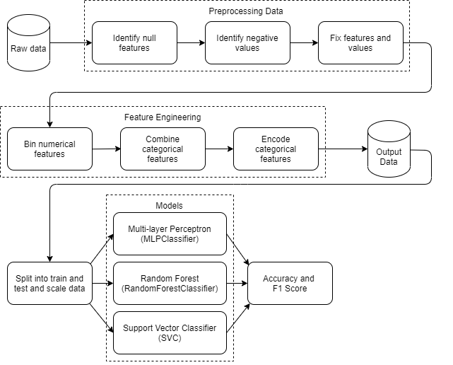

# README for AISG Submission

## **a. Full name (as in NRIC) and email address.**

Full name: Basyir Bin Othman
Email address: basyir.othman@u.nus.edu

## **b. Overview of the submitted folder and the folder structure.**

```
├── src
│   └── main.py
│   └── settings.py
│   └── preprocessing.py
│   └── feature_engineering.py
│   └── models.py
├── data
│   └── survive.db
├── README.md
├── eda.ipynb
├── requirements.txt
└── run.sh
```

## **c. Instructions for executing the pipeline and modifying any parameters.**

1. From the source folder, run `pip3 install -r requirements.txt`. This should load up all necessary dependencies for the EDA and for the main program
2. Run `./run.sh`. If there is an error, try running `chmod u+x run.sh` first

Within the pipeline, 3 models from `scikit-learn` are used (`MLPClassifier`, `RandomForestClassifer` and `SVC` (SupportVectorClassifier)). If you wish to test other models from `scikit-learn` out (or try other hyperparameters):<br>

1. Navigate to `src/models.py` and import the relevant model from `scikit-learn`
2. Go to the function `define_models` and add your model

## d. Description of logical steps/flow of the pipeline.



### 1. Preprocessing

1. Null features and numerical features with negative values are processed and fixed as their values are incorrect
2. Null features are replaced with the median values while numerical features take an `abs()` value
3. Relabel data that has the same label meanings but are inconsistent (eg `'Yes' and 'yes'`)

### 2. Feature engineering

1. Some numerical features are binned to ease skewed data
2. Some categorical features are combined to account for underrepresented groups
3. Categorical features are one-hot encoded for ML purposes

### 3. Modelling

1. Output data is scaled using `StandardScaler()` and passed into 3 models (`MLPClassifier`, `RandomForestClassifier` and `SVC`)
2. Metric scores like `accuracy` and `f1_score` are obtained

## **e. Overview of key findings from the EDA**

### 1. Preprocessing and Findings

1.  There were 1843 repeated ids from **ID**. Upon further investigation, the values for some repeated IDs are impossible so all repeated IDs were dropped.
2.  Surival rate for this dataset is slightly biased towards non-survivors (only 32.18% survived or had class 1)
3.  For numerical features:
    1. Some ages in **Age** was negative. `abs()` value of the ages were taken. Ranges of `abs()` ages were consistent with positive ages, so likely age value themselves were not errornous and only the negative was.
    2. **Creatinine** had missing values. All missing values came from non-survivors so the median value according to gender was used to fill up the missing values
    3. Some features were skewed (**Sodium**, **Creatinine**) and extremely skewed (**Platelets**, **Creatinine phosphokinase**).
    4. Survival rate increased as **Blood Pressure** increased
    5. Survival rate decreased as **Hemoglobin** increased
    6. Survival rate increased as **Weight** increased
    7. **Age** and **Height** showed no clear relationship to survival
4.  For categorical features:
    1. **Smoke** and **Ejection Fraction** had labels with same meaning but different syntax
    2. Survival rates for groups within each feature remained almost consistent, except for **Ejection Fraction**
    3. However, across the groups, clear relationships were seen for survival rates
    4. **Favorite Color** seems to play no part in survival rate

### 2. Feature Engineering

1. Skewed numerical features from 1.3 were binned to obtain the following:
   1. Survival decreased as **Sodium** increased
   2. Survival increased as **Creatinine** increased
   3. **Platelets** and **Creatine phosphokinase** showed no clear relationships to survival
2. Grouped high and normal for **Ejection Fraction** as high was very underrepresented
3. Best dataset obtained had dropped **Favorite color** and **Height** dropped after model evaluation

## **f. Explanation of your choice of models for each machine learning task.**

3 models were used for evaluation, MLPClassifier (Neural Network), RandomForestClassifier, AdaBoostClassifier

1. MLPClassifier:
   - Neural networks with perform quite well on classification tasks with distinct features and are easily customizable by varying the number of hidden neurons and hidden layers to improve performance on the task
2. RandomForestClassifier:
   - Decision trees are usually good at separating features according to how much a certain feature plays a part in determining the output. By combining many decision trees (random forest), we can aggregate a good model output
3. AdaBoostClassifier:
   - AdaBoost is good at combining weak learners into a single strong classifier. Adaboost would work well with using the other classifiers above and thus would naturally be a good model to use.
## **g. Evaluation of the models developed.**

Metrics at time of writing:

- MLPClassifier
  - Accuracy - 99.85%
  - F1 Score - 1.00
- RandomForestClassifier
  - Accuracy - 90.48%
  - F1 Score - 0.83
- AdaBoostClassifier
  - Accuracy - 99.14%
  - F1 Score - 0.99

MLPClassifier is the best amongst the models as it has the highest accuracy and the highest F1 score. Despite the dataset being slightly skewed towards non-survivors, the F1 score shows that there is little misclassification in important output (more true positives and lesser false negatives)
